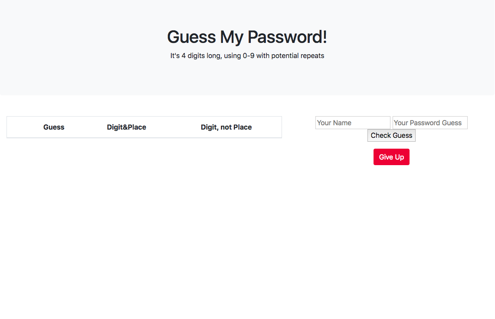
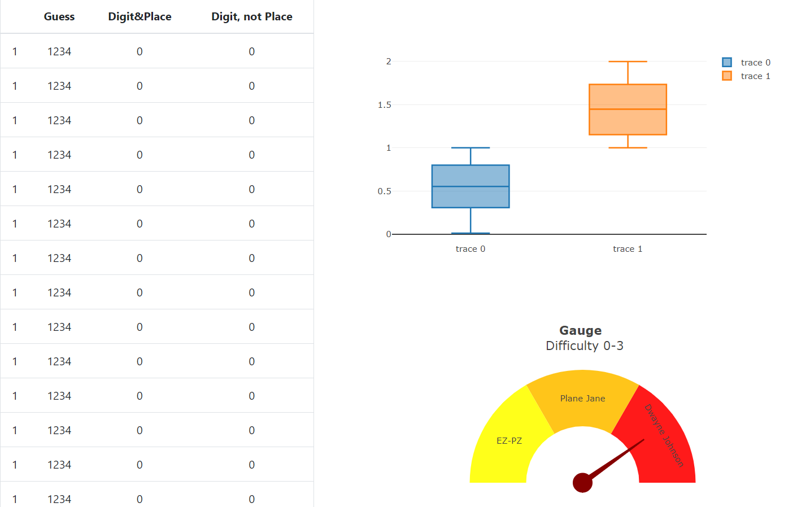
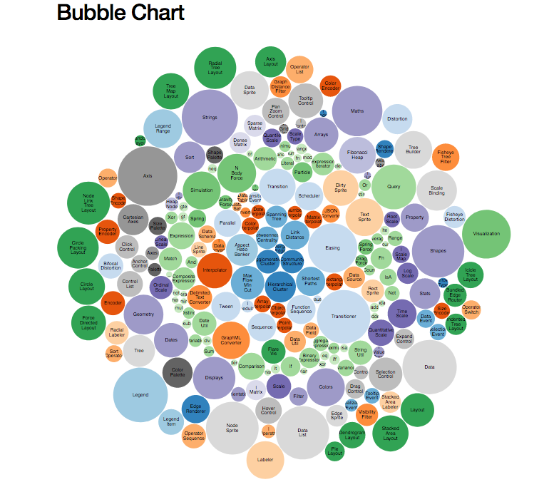

### Group Project #2 
### Title: Codebreaker
### Team: Alexander, Beatriz, Hee and Angela

### Proposed project:
### Theme-

With skills gained from the Data Analytics bootcamp, you have started a new career as a criminal focusing on creating applications for stealing peoples debit cards and pin numbers. With help from JavaScript and Python, you have developed a system to detect pin numbers based on guesses entered and adjusting numbers based on feedback given. With the generated pin number being a 4-digit code using 0-9 with potential repeats, you will need to solve the pin in as few guesses as possible before the authorities are alerted! Staying true to the inner data nerd, you will track the pin and guess information to observe the behavior of the users of this application and find the pattern that analyzes the difficulty of the pin numbers.

### Coding approach and data wrangling-
Our project will incorporate Python for data analysis. HTML/CSS and JavaScript, and Flask for web application, and D3.js for our visualizations. Heroku Postgres will be used to store player results in a database for later analysis. A proof-of-concept has already been developed using Python in Jupyter Notebook. Basic game functionality has also been deployed with Heroku - https://ucbe-mastermind.herokuapp.com/.

### Visualizations-
Our game will consist of three html pages. One will contain the actual game, with an input box and a table where the player can keep track of past guesses. There is also a button for those who just want to give up and end the game (Figure 1).

The second page will appear once the game is over. It will prompt the user to start a new game, and it will display how the player did in relation to other players (top 50 list or a boxplot showing where the player placed in relation to others). It will also contain a display indicating the pin difficulty score as a dial graph (easy, medium, difficult). Also, the table containing guesses from the previous game will be color coded to show if there is a pattern/strategy or not on how the game was played - right number and right position in green; right number and wrong position in orange; wrong number in red (Figure 2). 

The third page will be the “Hall of Fame” page. A bigger circle indicates winners with the least number of attempts (Figure 3 example).

